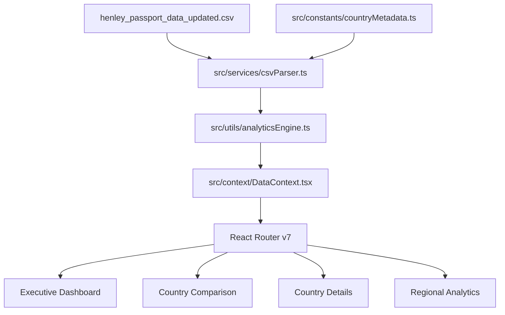

# Henley Passport Index Analytics Studio

An enterprise-grade, high-performance analytical dashboard application for global passport mobility, rankings, regional comparisons, and historical trends (2006–2026).


---

## 🌟 Key Features

1. **Executive Dashboard (Page 1)**:
   - 12 Executive KPI Cards with Framer Motion counter animations, YoY trend badges, and SVG sparklines.
   - Interactive World Map Choropleth powered by `react-simple-maps` with zoom/pan and rich country tooltips.
   - Top 10 Strongest & Bottom 10 Weakest Passport horizontal bar charts.
   - Continent average rank breakdown and rank density distribution charts.
   - Master Grid Table with virtualized scrolling, multi-column sorting, search filter, and Excel (`.xlsx`) export.

2. **Country Comparison Studio (Page 2)**:
   - Side-by-side historical trajectory comparison for up to 5 countries simultaneously over 2006–2026.
   - Multi-Line time-series chart with zoom, pan, hover tooltips, and metric mode toggle (Rank Position vs. Visa-Free Access Count).
   - Side-by-side comparative metrics matrix table.
   - High-resolution CSV / Excel data export.

3. **Granular Country Details (Page 3)**:
   - Comprehensive profile view for any passport jurisdiction with capital city, continent, UN region, and ISO codes.
   - 20-Year historical rank and visa-free access growth timelines.
   - Year-by-year rank shift breakdown table.

4. **Regional Analytics (Page 4)**:
   - Continent & UN Region aggregation engine computing average rank, median rank, and regional mobility spread.
   - Regional density scatter plots and rank distribution density charts.

5. **Enterprise Design System**:
   - Bloomberg Terminal / Stripe Analytics inspired styling with Gold, Blue, Emerald, and Rose color accents.
   - Dark & Light mode theme switcher with persistent local storage state.
   - Responsive layout optimized for ultra-wide, desktop, tablet, and mobile screens.

---

## 🏗️ Folder Architecture

```
Passport_Dashboard/
├── backend/                  # FastAPI Python backend microservice
│   ├── app/
│   │   ├── main.py
│   │   └── models/
│   └── requirements.txt
├── src/
│   ├── api/                  # API client services
│   ├── assets/               # Static icons, geojson, and flags
│   ├── charts/               # Reusable Recharts/D3 chart wrappers
│   │   ├── MultiLineChart.tsx
│   │   ├── TopBottomBarChart.tsx
│   │   ├── ContinentAverageChart.tsx
│   │   ├── RankDistributionChart.tsx
│   │   └── ScatterPlotChart.tsx
│   ├── components/
│   │   ├── kpi/              # Animated KPI metric cards
│   │   ├── layout/           # Header with global search, Sidebar navigation
│   │   ├── map/              # Interactive World Map choropleth
│   │   └── table/            # Master Data Grid table with sorting & Excel export
│   ├── constants/            # Country metadata map (ISO codes, flags, capitals, regions)
│   ├── context/              # DataProvider context & state engine
│   ├── layouts/              # MainLayout wrapper
│   ├── pages/                # 4 Primary Application Pages
│   │   ├── ExecutiveDashboard.tsx
│   │   ├── CountryComparison.tsx
│   │   ├── CountryDetails.tsx
│   │   └── RegionalAnalytics.tsx
│   ├── services/             # CSV parser service (PapaParse)
│   ├── styles/               # Tailwind & CSS custom properties
│   ├── theme/                # ThemeProvider (Dark/Light mode)
│   ├── types/                # TypeScript interface definitions
│   └── utils/                # Analytics engine (Volatility, Median, Yo-Yo Change)
├── index.html
├── package.json
├── tailwind.config.js
├── tsconfig.json
└── vite.config.ts
```

---

## 📐 Architecture Diagram (Mermaid)



---

## 🚀 Quick Start Guide

### Prerequisites
- Node.js `v18.0+`
- npm `v9.0+`

### Installation & Local Run

```bash
# 1. Clone the repository
git clone https://github.com/AnkonBanik/HenleyPassportGlobalRank.git
cd HenleyPassportGlobalRank

# 2. Install dependencies
npm install

# 3. Start development server
npm run dev
```

Open `http://localhost:5173` in your browser.

### Production Build

```bash
npm run build
```

---

## 📄 License
Released under the MIT License.
